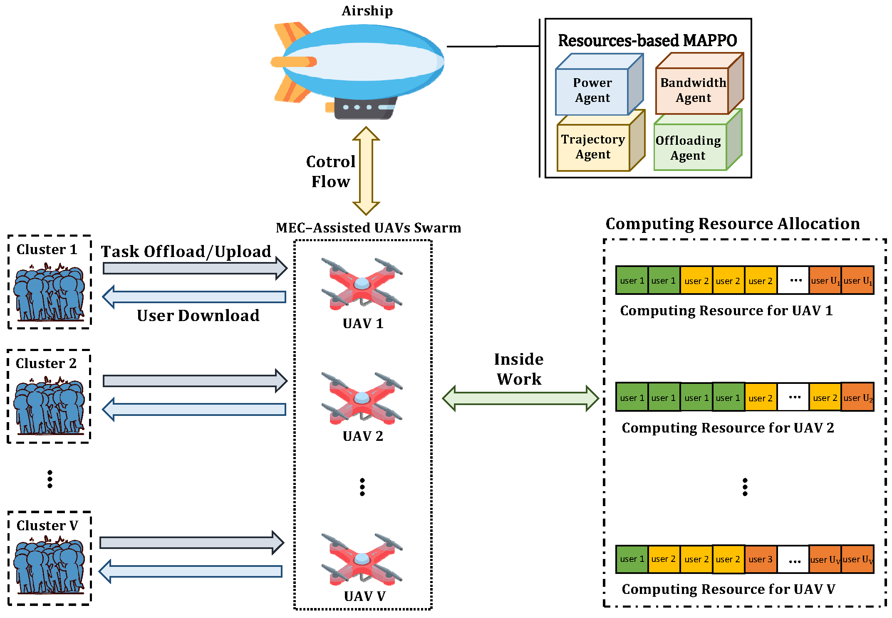
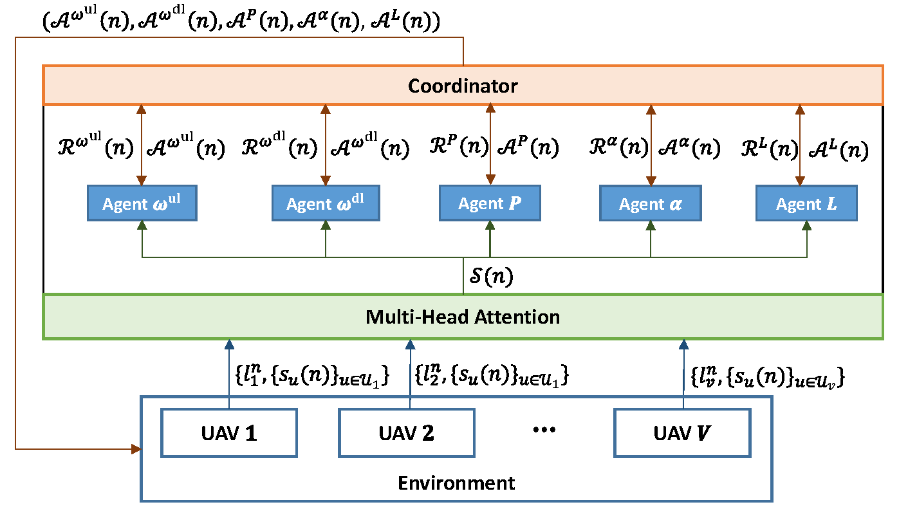

# Resources-Optimization-based-Reinforcement-Learning

## Overview
This is the Simulation code for Joint Trajectory and Resource Optimization of MEC-Assisted UAVs in Sub-THz Networks: A Resources-based Multi-Agent Proximal Policy Optimization DRL with Attention Mechanism

Terahertz (THz) band communication technology will be used in the sixth-generation (6G) networks to enable high-speed and high-capacity data service demands. However, THz-communication losses arise owing to limitations, i.e., molecular absorption, rain attenuation, and coverage range. Furthermore, to maintain steady THz-communications and overcome coverage distances in rural and suburban regions, the required number of base stations (BSs) is very high. Consequently, a new communication platform that enables aerial communication services is required. Furthermore, the airborne platform supports line-of-sight (LoS) communications rather than non-LoS (NLoS) communications, which helps overcome these losses. Therefore, in this work, we investigate the deployment and resource optimization for multi-access edge computing (MEC)-enabled unmanned aerial vehicles (UAVs), which can provide THz-based communications in remote regions. To this end, we formulate an optimization problem to minimize the sum of the energy consumption of both MEC-UAV and mobile users (MUs) and the delay incurred by MUs under the given task information. The formulated problem is a mixed-integer nonlinear programming (MINLP) problem, which is NP-hard. We decompose the main problem into two subproblems to address the formulated problem. We solve the first subproblem with a standard optimization solver, i.e., CVXPY, due to its convex nature. To solve the second subproblem, we design a resources-based multi-agent proximal policy optimization (RMAPPO) deep reinforcement learning (DRL) algorithm with an attention mechanism. The considered attention mechanism is utilized for encoding a diverse number of observations. This is designed by the network coordinator to provide a differentiated fit reward to each agent in the network. The simulation results show that the proposed algorithm outperforms the benchmark and yields a network utility which is $2.22\%$, $15.55\%$, and $17.77\%$ more than the benchmarks.

## Version
- Unity 2020.3.25f1
- ML-agents Release 17
- python 3.8
- Pytorch 1.8.0

## License
Copyright (c) 2020 Networking Intelligence
Redistribution and use in source and binary forms, with or without modification, are permitted provided that the following conditions are met:

1. Redistributions of source code must retain the above copyright notice, this list of conditions and the following disclaimer.

2. Redistributions in binary form must reproduce the above copyright notice, this list of conditions and the following disclaimer in the documentation and/or other materials provided with the distribution.

THIS SOFTWARE IS PROVIDED BY THE COPYRIGHT HOLDERS AND CONTRIBUTORS "AS IS" AND ANY EXPRESS OR IMPLIED WARRANTIES, INCLUDING, BUT NOT LIMITED TO, THE IMPLIED WARRANTIES OF MERCHANTABILITY AND FITNESS FOR A PARTICULAR PURPOSE ARE DISCLAIMED. IN NO EVENT SHALL THE COPYRIGHT HOLDER OR CONTRIBUTORS BE LIABLE FOR ANY DIRECT, INDIRECT, INCIDENTAL, SPECIAL, EXEMPLARY, OR CONSEQUENTIAL DAMAGES (INCLUDING, BUT NOT LIMITED TO, PROCUREMENT OF SUBSTITUTE GOODS OR SERVICES; LOSS OF USE, DATA, OR PROFITS; OR BUSINESS INTERRUPTION) HOWEVER CAUSED AND ON ANY THEORY OF LIABILITY, WHETHER IN CONTRACT, STRICT LIABILITY, OR TORT (INCLUDING NEGLIGENCE OR OTHERWISE) ARISING IN ANY WAY OUT OF THE USE OF THIS SOFTWARE, EVEN IF ADVISED OF THE POSSIBILITY OF SUCH DAMAGE.
